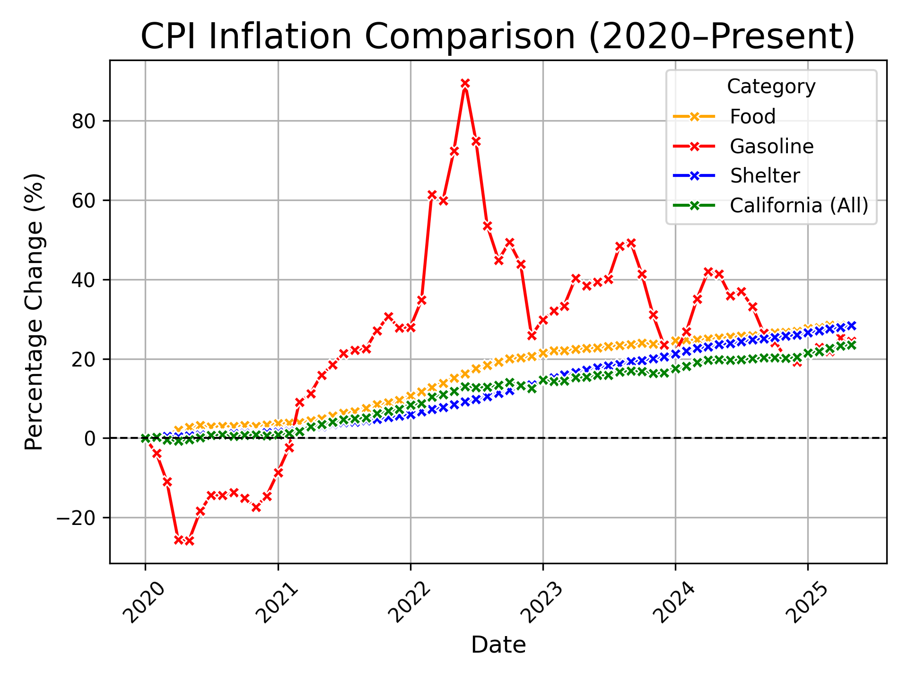
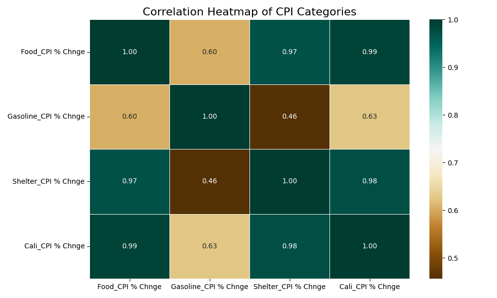

# U.S. CPI Inflation Analysis (2020 – 2025)

A data-driven analysis of U.S. consumer price trends from **January 2020 through mid-2025**, focusing on three essential household spending categories — **Food**, **Gasoline**, and **Shelter** — with a regional comparison for the **Los Angeles metro area** (California).

Built with Python using BLS CPI-U (Not Seasonally Adjusted) data. All results are fully reproducible from the source CSVs.

---

## Purpose

This project investigates how inflation has affected everyday consumer costs since the onset of the COVID-19 pandemic. Rather than using raw CPI index values, all series are re-indexed to **January 2020 = 0%**, making cumulative price changes directly comparable across categories — regardless of each series' different base levels.

The analysis answers three questions:
- How much have Food, Gas, and Shelter costs risen since January 2020?
- Which categories are most volatile vs. most persistent?
- How does the Los Angeles metro area compare to the national trend?

---

## Tools & Stack

| Tool | Purpose |
|---|---|
| Python 3.x | Primary analysis language |
| Pandas | Data cleaning, wrangling, and percent-change computation |
| Matplotlib | Line chart visualizations |
| Seaborn | Correlation heatmap |
| Jupyter Notebook | Interactive development environment |
| VS Code | IDE |

---

## Project Structure

```
us-cpi-inflation-2020-2025/
├── src/
│   └── inflation_analysis.ipynb       # Full analysis: cleaning → stats → charts
├── data/
│   ├── raw/                           # Original BLS CSV downloads (not tracked in Git)
│   └── processed/
│       └── CPI_Percent_Change_Final.csv   # Final tidy dataset
├── figures/
│   ├── food_cpi_chart.png
│   ├── gas_cpi_chart.png
│   ├── shelter_cpi_chart.png
│   ├── cali_cpi_chart.png
│   ├── combined_cpi_comparison_chart.png
│   └── cpi_correlation_heatmap.png
├── docs/
│   ├── insights.md                    # findings & implications
│   ├── project-notes.md               # Detailed methodology, BLS series IDs, output index
│   └── data-dictionary.md             # Column definitions, derivation formula, source metadata
├── requirements.txt
└── .gitignore
```

---

## Data Source

All data retrieved from the **U.S. Bureau of Labor Statistics (BLS)**
→ [https://www.bls.gov/cpi/](https://www.bls.gov/cpi/)

| BLS Series ID | Description |
|---|---|
| `CUUR0000SAF` | Food & Beverages — U.S. City Average, All Urban Consumers (NSA) |
| `CUUR0000SETB01` | Gasoline (All Types) — U.S. City Average, All Urban Consumers (NSA) |
| `CUUR0000SAH1` | Shelter — U.S. City Average, All Urban Consumers (NSA) |
| `CUURS49ASA0` | All Items — Los Angeles–Long Beach–Anaheim, CA (NSA) |

> Raw files are stored in `data/raw/` and excluded from Git (see `.gitignore`). They can be re-downloaded directly from BLS using the Series IDs above.

---

## Methodology

**Baseline:** January 2020 = 0% change

**Formula — cumulative percent change from baseline:**

$$\text{PctChange}_t = \frac{\text{CPI}_t - \text{CPI}_{\text{Jan 2020}}}{\text{CPI}_{\text{Jan 2020}}} \times 100$$

**Steps:**
1. Download and clean CSVs from BLS; parse dates, check for missing values
2. Align all four series to a common monthly date range
3. Apply baseline indexing formula to each series
4. Compute descriptive statistics (mean, median, 75th percentile, max, std dev)
5. Generate individual and combined visualizations
6. Run Pearson correlation analysis across all series
7. Export cleaned dataset to `data/processed/`

---

## Key Findings

| Category | Mean Δ | Median Δ | Max Δ | Std Dev |
|---|---|---|---|---|
| Food | 15.75% | 19.20% | 28.79% | 9.75 |
| Gasoline | 24.40% | 26.47% | 89.48% | 24.69 |
| Shelter | 12.44% | 11.35% | 28.37% | 9.59 |
| California (All) | 11.28% | 13.08% | 23.49% | 7.79 |

- **Food:** Steady cumulative climb — grocery costs up ~29% from Jan 2020 levels by mid-2025.
- **Gasoline:** Highest volatility (σ = 24.69). Peaked at +89.5% above baseline in mid-2022, driven by the Russia–Ukraine conflict and refinery supply constraints.
- **Shelter:** Never declined across the entire period. Slow but relentless — now over 28% above 2020 levels and still rising. Most persistent category.
- **California (LA):** Consistently above national averages, largely due to structural housing costs (r = 0.98 vs. national Shelter CPI).

> **For full analysis, statistical interpretation, and policy implications → [`docs/insights.md`](docs/insights.md)**

---

## Key Figures

### Combined CPI Comparison (2020–2025)


### Correlation Heatmap


---

## Correlation Highlights

| Pair | r | Interpretation |
|---|---|---|
| Food ↔ California | 0.99 | Food inflation closely mirrors the LA metro basket |
| Food ↔ Shelter | 0.97 | Both reflect persistent structural cost trends |
| Shelter ↔ California | 0.98 | Housing dominates the CA metro index |
| Gasoline ↔ Shelter | 0.46 | Energy shocks do not drive housing costs |

---

## Reproducibility

```bash
# 1. Clone the repo
git clone https://github.com/Robby-Deffo/us-cpi-inflation-2020-2025.git
cd us-cpi-inflation-2020-2025

# 2. Install dependencies
pip install -r requirements.txt

# 3. Launch the notebook
jupyter notebook src/inflation_analysis.ipynb
```

> **Note:** Raw BLS data files are not included in the repository. Re-download them from [bls.gov/cpi](https://www.bls.gov/cpi/) using the Series IDs listed above and place them in `data/raw/`.

---

## Documentation

| File | Description |
|---|---|
| [`docs/insights.md`](docs/insights.md) | Full academic-style findings: per-category analysis, correlation breakdown, macro/policy implications, limitations |
| [`docs/project-notes.md`](docs/project-notes.md) | Detailed methodology notes, BLS series IDs, step-by-step process, output file index |
| [`docs/data-dictionary.md`](docs/data-dictionary.md) | Column definitions, baseline convention, derivation formula, NSA notes |

---

## Author

**Robby Deffo**
M.S. Business Analytics Candidate — CSUN (May 2026)
[GitHub](https://github.com/Robby-Deffo) · [LinkedIn](https://linkedin.com/in/robby-deffo-394579229)